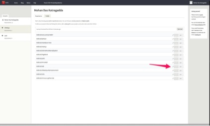

# Setting up Travis CI for Open Source REDI project

For testing purposes I have forked the REDI repository to my GITHUB account mdk142.

## Steps to setup Travis CI for REDI:

1)	Sign in to travis using Github account (ctsit)


2)	Give permissions to travis to clone and sync github repositories when asked.


3)	Activate a webhook on the repo on your choice


a.	Go to repositories in your profile (Click on your profile as shown below)



b.	 Flip the switch against the repo of your choice to enable webhook for that repo. Check below Image 



4)	Create a .travis.yml file and add it to your repository. I have created a basic .travis.yml, which work for current REDI. Below are its contents

```
language: python
python:
  - "2.7"
before_install:
  sudo apt-get install -y python-setuptools libxml2 libxslt1-dev python-dev
install:
  - pip install requests
  - pip install lxml
  - pip install appdirs

script: make test

branches:
  only:
    - master
    - develop

```

5)	The contents listed above are pretty basic. For any additional features you need to configure refer this [link](http://docs.travis-ci.com/user/build-configuration/).


6)	Travis is now configured to your repository. For each new commit made to the master branch, travis will run new build for your repository and results will be mailed to 
the email registered in your github account. 


7)	You can also view results on your Travis dashboard as shown in the below image.


 

## CTS-IT Responsibilities when a pull request is submitted on REDI

1)	When REDI gets a pull request, CTS-IT coordinator should open the pull request. This initiates Travis to run tests against pull request and displays the results.


2)	Pull requests that passed the tests looks like as shown in the image.


 
3)	Pull requests that failed the tests looks like as shown in the image below.



## Responsibilities of Developer who is submitting a Pull Request:
1)	Fork the REDI repository. You will get a .travis.yml with the fork.


2)	Setup a travis account for your github account and give permissions for travis to run build.


3)	With this you should receive travis reports for each commit you push to your forked repository.


4)	Before submitting a pull request, make sure tests in your travis report are all passing.
