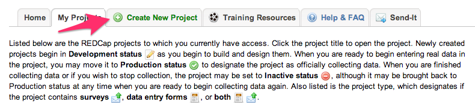
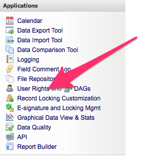

Add new REDCap Project and API Key
==================================

Steps
=====

Once you have the RED-I configuration ready you can create a new REDCap
project

Note: The instructions below assume you have the permissions to create a
new REDCap project, create a user, set user permissions, and create an
API Token. Depending on how your REDCap server is configured you may or
may not have the permissions to do these tasks yourself. Please consult
with your local REDCap managers for assistance if you do not see these
options.

1. Create new Project
---------------------

Open in the browser the REDCap url. Select the ``Create New Project``
tab. Enter ``<your_project_name>`` for the project title. Please check
below images for reference.

.. figure:: images/add_new_redcap_project/image_1.png
   :alt: alt text

2. Authorize People
-------------------

To adjust user rights, access the User Rights tool via the menu on the
left side of the REDCap screen.

or click on ``User Rights`` button in the ``Project Setup``

.. figure:: images/add_new_redcap_project/image_4.png
   :alt: alt text

In REDCap User Rights, set ``Data Entry Rights`` as per your
needs.Please check below image

.. figure:: images/add_new_redcap_project/image_6.png
   :alt: alt text

3. Create an API Token
----------------------

For the data in your project to be used by programs, those programs will
need access through API interface. You will need to create an API Token
to allow those programs to authenticate and get the correct permissions
on your project.

This token can be created on any account, but for automated processes a
service account will provide a more reliable authentication. Add a user
in this REDCap project with the permissions shown below:

.. figure:: images/add_new_redcap_project/image_11.png
   :alt: alt text

After you have created the new user, login as that user and request an
Read-only API button on the left hand toolbar.

.. figure:: images/add_new_redcap_project/image_12.png
   :alt: alt text

4. Export Data
--------------

If you have data in this project that needs to be preserved, you can
export it using the steps listed in the section ``2`` above.

5. Backup Data
--------------

If you would like to backup this project along with other ``REDCap``
projects, please follow the procedures listed in the section ``3``. If
you want to initialize the project with no data in it, follow the
procedures in section ``2``.

6. Document the Existence of the Project
----------------------------------------

Please update the README-projects.md document with a detailed decription
of the new project.
