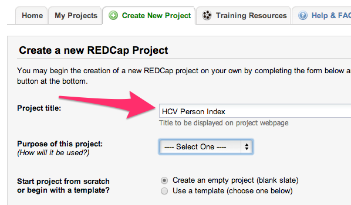
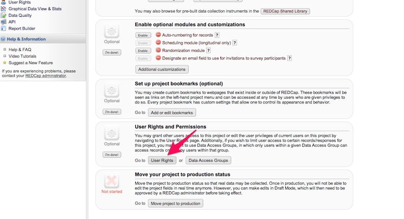
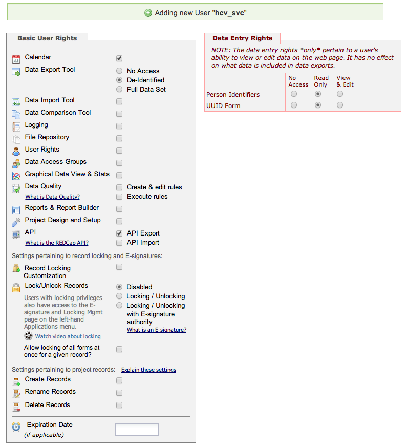
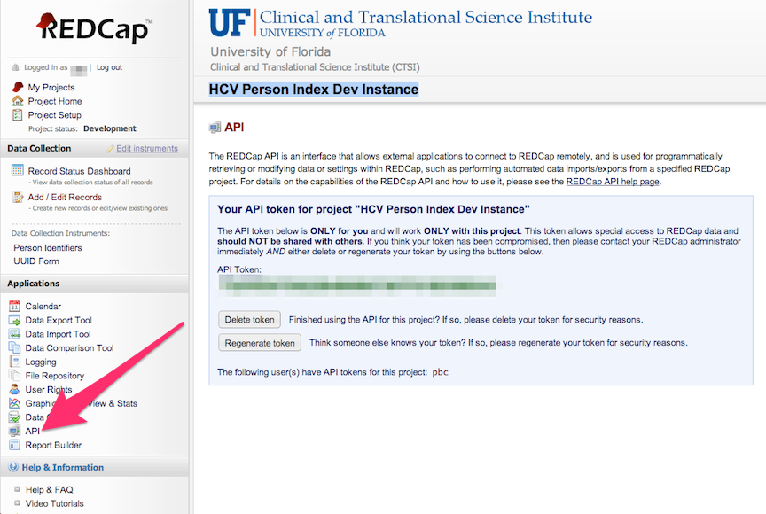

# REDCap Project Testing

This vagrant VM is a REDCap testing VM it is designed to start a configurable version of REDCap with a configurable MySQL dump file.

## 1.Configure the VM
Before you can use the VM you must obtain a copy of the redcap software from 
   http://project-redcap.org/
and save it as 'redcap.zip'.

@TODO: Need a sample redcap project and test data set.

The user is expected to provide the binary file 'redcap.zip' in the same folder as the Vagrantfile.
This ensures that the 'bootstrap.sh' script can extract the files to the virtual machine path '/var/www/redcap'.
A typical listing of the '/var/www/redcap' folder after extraction is:

   api
   
   cron.php
   
   database.php
   
   edocs
   
   index.php
   
   Installation Instructions.txt
   
   install.php
   
   languages
   
   redcap
   
   REDCap License.txt
   
   redcap_v4.14.2_
   
   robots.txt
   
   surveys
   
   temp
   
   upgrade.php
   
   webtools2

## 2.SqlPatches 

Review the files in 'sqlPatches' to make sure they meet your needs. 

 * updateBaseURL.sql - sets the redcap_base_url to '/redcap/'.  This aids URL rewriting.
 * updateUsers.sql - resets every password to 'password'.
 * addAdminUser.sql - If correctly edited, this file will add a user 'admin' with password 'password'.
Edit the list of forms in the last INSERT command and adjust the API Token to meet your needs.

To run additional sql scripts just save them to the 'sqlPatches' folder.

## 3.Start the VM

To use this VM you will need to install Vagrant and Virtual Box.

With these packages installed, follow this procedure to use a VM template:

    cd ./vagrant
    vagrant up

Vagrant will instantiate and provision the new VM.  Web applications should be accessible at

   http://localhost:8998/

If that port is already in use vagrant will choose a different port automatically.
Read the log of "vagrant up" and note the port redirect used.

## 4.Connect to VM
The command `vagrant ssh` launches a full-fledged SSH session. To access all the necessary scripts and sql patches run below commands

`cd /vagrant`

One can find `scripts` and `sqlPatches` directories at this location.

## 5.REDCap Database maintainance

`redcapdbm.php` is a tool which allows to perform basic maintaince of the RedCap database. This tool is located at `/vagrant/scripts` directory on the VM

### 5.1.To delete data from REDCap
Please follow below procedure to delete data from your REDCap project

`cd /vagrant/scripts`

`php redcapdbm.php -l` this command list of REDCap projects available along with project_id

`php redcapdbm.php -d <project_id>` Choose a project_id from the output of above command and pass it as a parameter for this command. This command deletes records from the project you have chosen.

### 5.2.To load data into REDCap
`redcap_records.py` tool can be used for loading data into REDCap. Please refer below to learn how you can use `redcap_records.py` to import and export records from REDCap.

#### 5.2.1.Data imports and exports

You can perform basic data imports and exports with the VM using the tool redcap_records.py.  
##### Usage
`redcap_records.py` [OPTIONS]
##### OPTIONS

`--token` 		Specify the authentication/authorization token that will provide access to the REDCap project

`--url`   		Specify the url of the REDCap server to connect with

`--verify_ssl` Specify whether the SSL cert of the REDCap server should be checked. provide 'y' to verify

`--import_data`	Specify the input data file to load into REDCap

`--forms`		Specify a list of forms, separated by spaces, for which data should be returned.

Below is an example for export

    ./bin/utils/redcap_records.py --token=121212 --url=http://localhost:8998/redcap/api/ --forms demographics

If the above content is redirected to a file, demographics.csv, that data can be re-imported with this command:

    ./bin/utils/redcap_records.py --token=121212 --url=http://localhost:8998/redcap/api/ -i demographics.csv

### 5.3.To backup the redcap database
Please follow below procedure to backup your REDCap database

`cd /vagrant/scripts`

`php redcapdbm.php -b` This command backups database schema and partial data

A file named in the format `backup-redcap-XXXX.sql` will be saved in the `scripts` directory. If you want this `backup-redcap-XXX.sql` to be default for this VM, rename it to `/vagrant/projectDataBootstrap.sql`. Please dont forget to update this file in version control.

## 6.Updating redcap.zip with new content
While updating redcap.zip with new content one needs to make sure that all of the contents listed in the `Configure VM` step above has to go into the directory `redcap`. This ensures that when a `redcap.zip` file is extracted, the root folder is named `redcap` and contains the files listed above in the `Configure VM`.

## 7.Add new REDCap Project and share it with team members
The instructions below assume you have the permissions to create a new REDCap project,create a user, set user permissions, and create an API Token. Depending on how your REDCap server is configured you may or may not have the permissions to do these tasks yourself. Consult with your local REDCap managers for assistance if you do not see these options.

### 7.1.Create new Project
Select the `Create New Project` tab. Enter `<your_project_name>` for the project title. Please check below images for reference.

### 7.2.Authorize People
To adjust user rights, access the User Rights tool via the menu on the left side of the REDCap screen. 

or click on `User Rights` button in the `Project Setup`

In REDCap User Rights, set `Data Entry Rights`  as per your needs.Please check below image

### 7.3.Create API Token
For the data in your project to be used by programs, those programs will need access through REDCap's API interface. You will need to create an API Token to allow those programs to authenticate and get the correct permissions on your project.

This token can be created on any account, but for automated processes a service account will provide a more reliable authentication. Add a user in this REDCap project with the permissions shown below

After you have created the new user, login as that user and request an Read-only API button on the left hand toolbar.

### 7.4.Export Data
If you have data in this project that needs to be preserved, you can export it using the steps listed in the section `5.2` above.

### 7.5 Backup Data
If you would like to backup this project along with other `REDCap` projects, please follow the procedures listed in the section `5.3`. If you want to initialize the project with no data in it, follow the procedures in section `5.2`.

### 7.6 Document the Existence of the Project
Please update the README-projects.md document with a detailed decription of the new project.